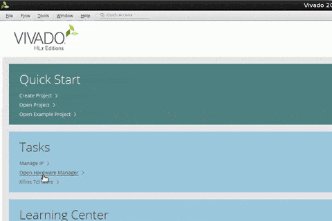
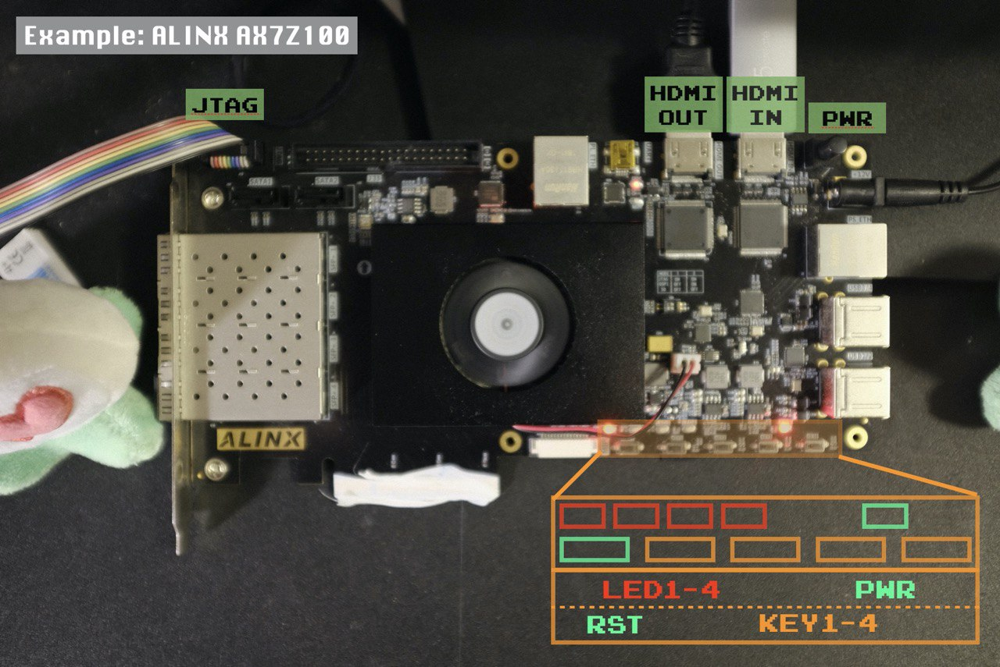

# *Deep:* Dark-Fantasy

> Global Dark mode for **ALL apps** on **ANY platforms**.

:arrow_down: See the demo below :arrow_down:


:arrow_up: See the demo above :arrow_up:

## How?

By putting an FPGA between your video card and monitor.

## Prerequisite

- You need a video card and a monitor that supports HDMI.
- You need an FPGA develop board with (at least) one HDMI input, one HDMI output, four buttons and four LEDs.
    - We officially support Alinx AX7Z100, which is based on Xilinx Zynq-7100, ADV7511, and SIL9013.
- You need some software (with proper licenses, if needed) to program your device with *Deep:* Dark-Fantasy.
    - We officially support Xilinx Vivado, version 2018.2.

## TL;DR

If you are using AX7Z100 and Xilinx Vivado, you can follow these step get *Deep:* Dark-Fantasy running on your FPGA.

1. Download our pre-built bitstream file (`output.bit`) from [here](https://github.com/b1f6c1c4/Deep-DarkFantasy/releases/latest/).
1. Launch Xilinx Vivado.
1. (See the Gif below) Click `Tasks` / `Open Hardware Manager`.
1. Click the `Auto Connect` button in the Hardware panel.
1. Select the bitstream file. Leave the Debug probes file empty.
1. Click `Program`.

    

1. Use a power adapter to supply the FPGA develop board.
1. Use a JTAG debugger connect FPGA develop board to your develop computer (where vivado exists).
1. Use an HDMI Cable connect your video source (video card / mother board video output) to the HDMI *IN* port of the board.
1. Use another HDMI Cable connect your video destination (monitor) to the HDMI *OUT* port of the board.
1. Power on the board.

    

1. There are four LEDs (besides the PWR indicator) on the board:

    | PCB Symbol | LED1 | LED2 | LED3 | LED4 |
    | ---------- | ---- | ---- | ---- | ---- |
    | Default | On | Off | Off | Off |
    | Indication | Block-based Fantasy | Line-based Fantasy | Frame-based Fantasy | Light-Fantasy |
    | Description | Pixels are grouped into `KH`-by-`KV` blocks. | Effectively set `KH` to infinity. | Effectively set `KH` and `KV` both to infinity. | Invert each pixel, becoming light mode. |

1. There are five buttons on the board:

    | PCB Symbol | RESET | KEY1 | KEY2 | KEY3 | KEY4 |
    | ---------- | ----- | ---- | ---- | ---- | ---- |
    | Function | System Reset | Fantasy Reset | Switch Fantasy | Invert Fantasy | No Fantasy |
    | Press or Hold | Press | Press | Press | Press | Hold Down |
    | Description | Remove the program from the device. | Switch to the default mode (Block-based Dark-Fantasy). | Switch between Block-based, Line-based, Frame-based, and Non-Fantasy mode. | Switch between Dark-Fantasy and Light-Fantasy. | When held down, temporarily show the original image. |

## Build *Deep:* Dark-Fantasy from source code

**If the default settings don't work for you for some reason, you should try build the project from source code.**

Note: You need `make`, `bash`, and `awk` to generate the bitstream file.

### Step 1: Get the source code

You need to (fork and) clone the repo first:
```bash
git clone --depth=1 https://github.com/b1f6c1c4/Deep-DarkFantasy.git
# Or, use git-get:
# git get b1f6c1c4/Deep-DarkFantasy
```

In the file `config` you can find the following parameters:
```verilog
# Video parameters
H_WIDTH=1920
H_START=2008
H_TOTAL=2200
V_HEIGHT=1080
FREQ=148.50

# Dark-Fantasy parameters
KH=30
KV=30
```

### Step 2: Configure the video parameters

Since most OS and video cards will adapt to whatever device connected to it,
you usually don't need to modify these parameters.
However, if it is NOT the case, you must either force your video card to cater to the FPGA,
or force your FPGA to cater to the video card.
The first way is usually easier, but here are are explaining the second way.

- If you are using Linux with X11, use the following command:

    ```bash
    xrandr --verbose
    ```
    And you will see tons of modelines.
    Find the one with ` *current`, which looks like:
    ```
    1920x1080 (0x1c8) 148.500MHz +HSync +VSync *current +preferred
          h: width  1920 start 2008 end 2052 total 2200 skew    0 clock  67.50KHz
          v: height 1080 start 1084 end 1089 total 1125           clock  60.00Hz
    ```
    Now you should know where does those magic numbers came from.
    Edit the parameters in `design/top.v` and `constr/ax7z100.xdc` to match the numbers from `xrandr`.

    Note: If you have multiple displays, pick the one you want to use *Deep:* Dark-Fantasy.
    You need one FPGA develop board *per display* if you want all your displays to be Dark-Fantasy.

- If you are using macOS or Windows, you are having some trouble.
    If you do encounter problems like this, please feel free to submit an [issue](https://github.com/b1f6c1c4/Deep-DarkFantasy/issues).

### Step 3: Configure the block size

You can modify the two parameter `KH` and `KV`.
It is used to specify the size of blocks - the smaller blocks are, the finer granularity Dark-Fantasy effect is achieved.
However, if the blocks are too small, texts will become illegible for read.
Furthermore, since the circuit area scales at `O(H_TOTAL*KV+H_TOTAL/KH)`,
a configuration with large `KV` or very small `KH` may be too big for your FPGA.
In that case you have to reduce `KV`, increase `KH`.
Alternatively, you can reduce display resolution and reduce `H_TOTAL` correspondingly.

### Step 4: Build the project

The project takes a while to build - usually several minutes to half an hour.
Multicore won't help.
```bash
# Specify your Xilinx Vivado installation
# Specify your Xilinx SDK installation
export VIVODO=/opt/xilinx/Vivado/2018.2
export SDK=/opt/xilinx/SDK/2018.2
# Perform synthsizing, implementation, and bitstream creation.
# This may take a while, so be patient
make
```

A bonus for cloning the repo is that you don't even need to launch Vivado to program your device:
You can just do this:

```bash
make program
```

And your FPGA is ready to go.

## Limitation

- It does not fully support `-Hsync` nor `-Vsync`.
- For large `KH` and small `KV`, it consumes too much FPGA resource.
- You need to re-program the device every time after a power cycle.

